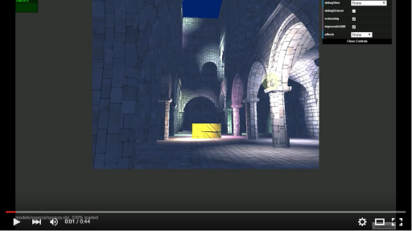

WebGL Deferred Shading
======================

**University of Pennsylvania, CIS 565: GPU Programming and Architecture, Project 6**

* Tongbo Sui
* Tested on: Google Chrome 46.0.2490.71, Firefox 41.0.2, on Windows 10, i5-3320M @ 2.60GHz 8GB, NVS 5400M 2GB (Personal)

### Live Online

### Demo Video

### Features and Analysis

**Effects:**

* Deferred Blinn-Phong shading [4]
  * Blinn-Phong lighting with normal mapping support, rendered in a separate pass outside fragment shader
  * *Optimization*:
  * *Possible further improvements*: 
* Bloom
  * Post-process Gaussian blur [1] used to simulate glow effect=
  * *Performance impact*:
    * If applicable, how do parameters (such as number of lights, etc.)
      affect performance? Show data with simple graphs.
  * *Optimization*:
  * *Possible further improvements*: 
* Toon shading
  * Ramp shading with an edge detector for rendering outlines [2][3]
  * *Performance impact*:
    * If applicable, how do parameters (such as number of lights, etc.)
      affect performance? Show data with simple graphs.
  * *Optimization*:
  * *Possible further improvements*: 
* Additional material properties
  * Supports specular exponent as an input to g-buffers
  * *Performance impact*: no visible impact

**Optimizations:**
* Scissoring
  * Scissor the screen for each light, such that it only renders in a rectangle around the light
  * Detailed performance improvement analysis of adding the feature
    * What is the best case scenario for your performance improvement? What is
      the worst? Explain briefly.
    * Are there tradeoffs to this performance feature? Explain briefly.
    * How do parameters (such as number of lights, tile size, etc.) affect
      performance? Show data with graphs.
    * Show debug views when possible.
      * If the debug view correlates with performance, explain how.
* Optimized g-buffer format, reduce the number and size of g-buffers:
  * Applying the normal map in the `copy` shader pass instead of copying both geometry normals and normal maps
  * Detailed performance improvement analysis of adding the feature
    * What is the best case scenario for your performance improvement? What is
      the worst? Explain briefly.
    * Are there tradeoffs to this performance feature? Explain briefly.
    * How do parameters (such as number of lights, tile size, etc.) affect
      performance? Show data with graphs.
    * Show debug views when possible.
      * If the debug view correlates with performance, explain how.
* Improved screen-space AABB for scissor test
  * Calculate bounding box at sphere's front-facing max circle to minimize distortion due to transformations
    * Faster
    * More accurate
    * Fixes artifacts caused by default AABB calculation
  * Detailed performance improvement analysis of adding the feature
    * What is the best case scenario for your performance improvement? What is
      the worst? Explain briefly.
    * Are there tradeoffs to this performance feature? Explain briefly.
    * How do parameters (such as number of lights, tile size, etc.) affect
      performance? Show data with graphs.
    * Show debug views when possible.
      * If the debug view correlates with performance, explain how.
* Two-pass Gaussian blur for better bloom performance [1]
  * Uses separate passes to apply convolution in both `x` and `y` directions
  * Detailed performance improvement analysis of adding the feature
    * What is the best case scenario for your performance improvement? What is
      the worst? Explain briefly.
    * Are there tradeoffs to this performance feature? Explain briefly.
    * How do parameters (such as number of lights, tile size, etc.) affect
      performance? Show data with graphs.
    * Show debug views when possible.
      * If the debug view correlates with performance, explain how.

## References

* [1] Bloom: [GPU Gems, Ch. 21](http://http.developer.nvidia.com/GPUGems/gpugems_ch21.html)
* [2] Edge detector: [Sobel Operator](https://en.wikipedia.org/wiki/Sobel_operator)
* [3] Toon ramping: [Cel shading](http://prideout.net/blog/?p=22#toon)
* [4] Blinn-Phong: [Blinn–Phong shading model](https://en.wikipedia.org/wiki/Blinn%E2%80%93Phong_shading_model)