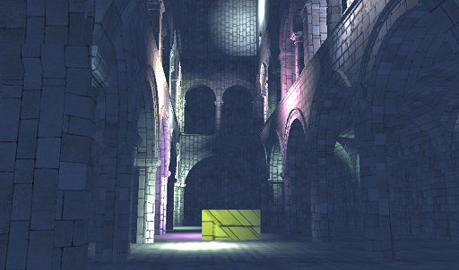
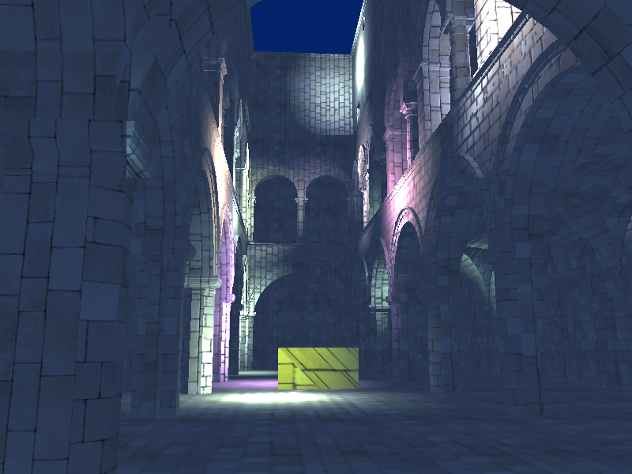
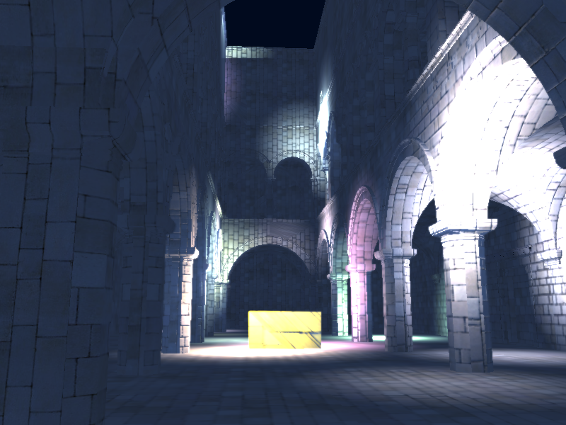
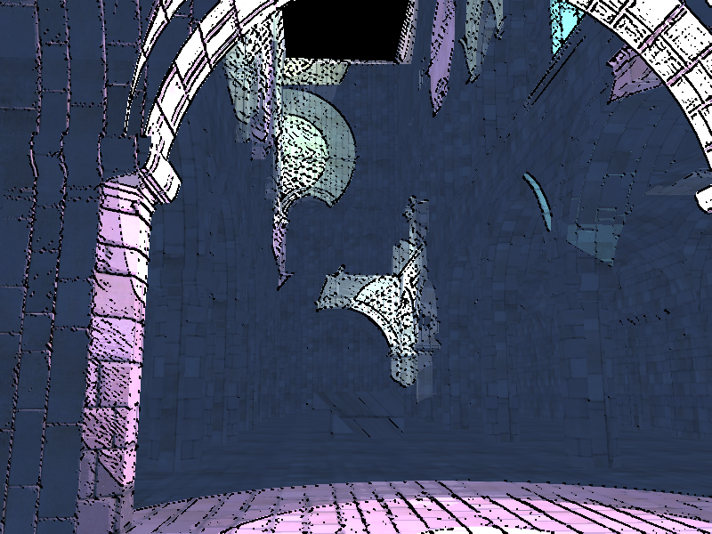
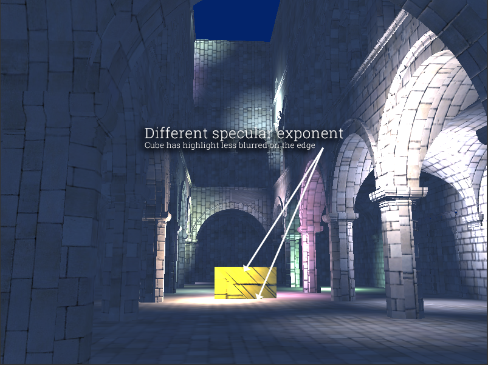
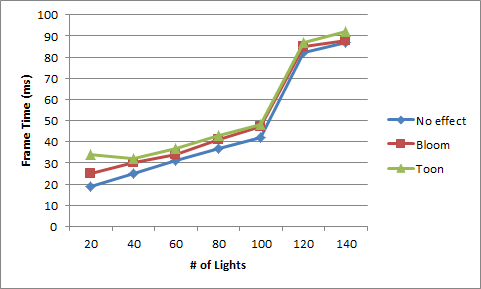
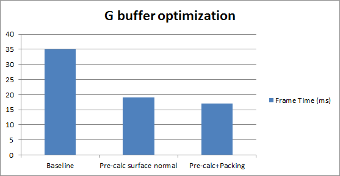
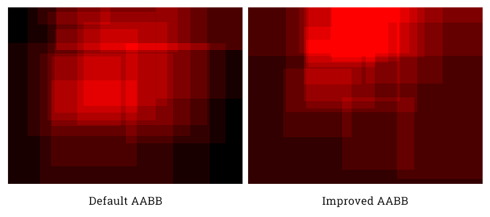
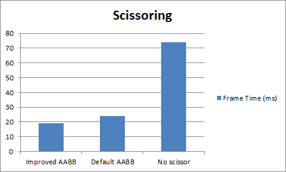
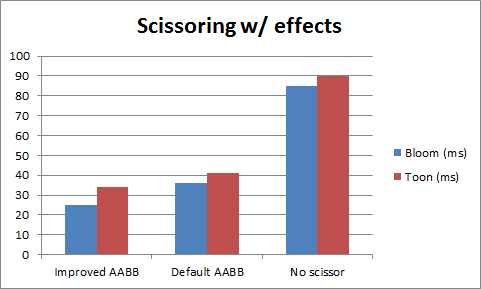

WebGL Deferred Shading
======================

**University of Pennsylvania, CIS 565: GPU Programming and Architecture, Project 6**

* Tongbo Sui
* Tested on: Google Chrome 46.0.2490.71, Firefox 41.0.2, on Windows 10, i5-3320M @ 2.60GHz 8GB, NVS 5400M 2GB (Personal)

### Live Online

### Demo Video

### Features and Analysis

#### Effects

* Deferred Blinn-Phong shading [4]
  * Blinn-Phong lighting with normal mapping support, rendered in a separate pass outside fragment shader
  * *Optimization*: remove out surface normal calculations (see Optimized g-buffer)
  * *Possible further improvements*: better falloff computation

###### Deferred render

* Bloom
  * Post-process Gaussian blur [1] used to simulate glow effect
  * *Optimization*: use two-pass Gaussian blur instead of one single convolution kernel
    * Single convolution kernel requires significantly more time to compute. For a 5x5 kernel, that would require 25 reads per fragment
    * On the other hand, two-pass convolution only needs 10 reads per fragment, which yields a 2.5x speedup
  * *Possible further improvements*: none
  * *Performance impact*: minor performance impact; see graph below

###### Bloom

* Toon shading
  * Ramp shading with an edge detector for rendering outlines [2][3]
  * Uses Sobel operator as edge detectors. The operator requires two convolution passes, each of which is a 3x3 kernel
  * *Possible further improvements*: more passes for faster convolution. E.g. break each pass further into 2 passes, so that in each pass the shader is only applying convolution with a 1D kernel 
  * *Performance impact*: medium performance impact; see graph below

###### Toon

* Additional material properties
  * Supports specular exponent as an input to g-buffers
  * *Performance impact*: no visible impact

###### Additional material property

###### Frame time (ms) with varying # of lights

#### Optimizations

* Optimized g-buffer format, reduce the number and size of g-buffers:
  * `master` branch: surface normal pre-calculation
    * Applying the normal map in the `copy` shader pass instead of copying both geometry normals and normal maps
    * *Performance analysis*
      * Significant improvement over non-optimized g-buffer for the following two reasons:
        * 1 less g-buffer to read/write. This results in overall shorter memory access time
        * Since the Blinn-Phong shader shades fragments in a loop, pre-calculating surface normal avoids recalculating surface normal over and over again inside the loop. This greatly reduces the computation time during deferred lighting
      * Tradeoff: less flexibility inside the shader. The shader won't get geometry normal as input.
  * `color-packing` branch: RGBA packing (**Chrome only**); code derived from [5]
    * On top of pre-calculating surface normal, packing RGBA information into a single floating point value in g-buffer
    * *Performance analysis*
      * Minor performance improvement, due to one less g-buffer and hence overall faster memory access
      * In general, this provides only marginal performance improvement, while reducing color quality greatly during color reconstruction
      * Tradeoff: significant loss in color quality
  * The reason why they are in two different branches is that color packing results in significant color quality loss in this implementation

###### Render with RGBA packing. Notice the reduced color quality of the reconstructed color map

###### G-buffer optimization effects

* Scissoring
  * Scissor the screen for each light, such that it only renders in a rectangle around the light
  * *Performance analysis*
    * Effectivity
      * Effective in most cases, as instead of calculating lighting for all fragments, only a small portion of the fragments participate in the actual computation. Hence if a fragment is lit by only a few lights, less computation is needed.
      * However, it becomes ineffective when number of lights increases to a significant amount. As seen in "Frame time" graph above, at 120 lights, the frame time increases dramatically. At this point, lots of lights are covering almost every fragment in the scene. Even though for each light, it's still scissored, but since there is too much overlapping, all fragments need to participate in the computation many times. Therefore the scissoring is much less effective
    * Tradeoff: some artifacts due to loose AABB calculation (fixed below)

###### Scissoring. Light boxes are in red. Darker means less light overlaps

* Improved screen-space AABB for scissor test
  * Calculate bounding box at sphere's front-facing max circle to minimize distortion due to transformations
  * *Performance analysis*
    * Faster scissor tests due to more accurate (smaller) AABB calculation. Potentially much less overlapping on the edge of each light, for each fragment
    * Fixes artifacts caused by default AABB calculation

###### AABB size comparison. Improved AABB calculation yields smaller scissor boxes

###### Scissoring performance (no effects)

###### Scissoring performance (effects)

* Two-pass Gaussian blur [1]
  * Uses separate passes to apply convolution in both `x` and `y` directions
  * *Performance analysis*
    * Faster post-processing
    * As stated previoiusly, single convolution kernel requires significantly more time to compute. For a 5x5 kernel, two-pass convolution yields a 2.5x speedup
    * Tradeoff: one more render pass. This requires one more buffer manipulation and memory setup

### References

* [1] Bloom: [GPU Gems, Ch. 21](http://http.developer.nvidia.com/GPUGems/gpugems_ch21.html)
* [2] Edge detector: [Sobel Operator](https://en.wikipedia.org/wiki/Sobel_operator)
* [3] Toon ramping: [Cel shading](http://prideout.net/blog/?p=22#toon)
* [4] Blinn-Phong: [Blinn–Phong shading model](https://en.wikipedia.org/wiki/Blinn%E2%80%93Phong_shading_model)

### Third-party codes
* [5] RGBA packing: [Aras Pranckevičius](http://aras-p.info/blog/2009/07/30/encoding-floats-to-rgba-the-final/) / [StackOverflow](http://stackoverflow.com/questions/30242013/glsl-compressing-packing-multiple-0-1-colours-var4-into-a-single-var4-variab)
